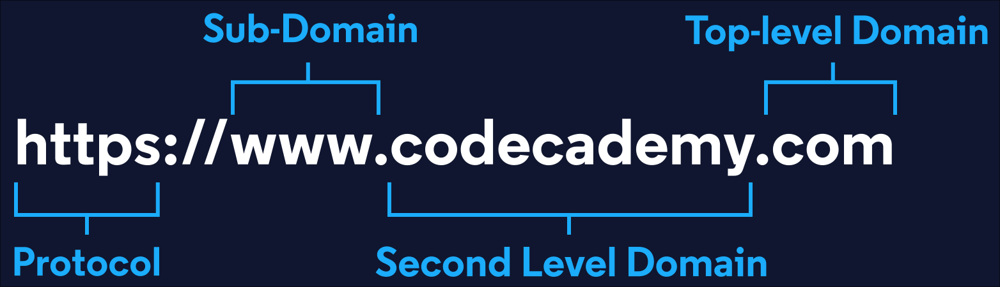

# Analyze-Common-Crawl-Data-with-PySpark
In this project, I analyze a small portion of a dataset published by the Common Crawl using PySpark

The Common Crawl is a non-profit organization that crawls, archives, and analyzes content on all public websites. The Common Crawl maintains petabytes (thousands of terabytes!) of web content and insights derived from their analyses, all of which is made publicly available for research and educational purposes.

In this project, I worked with a small portion of a dataset published by the Common Crawl. Analyzing Common Crawl data can be easier if you know a few key facts about the format of domain names. Every website’s name is composed of multiple parts, as illustrated in the following diagram:

The dataset I’ll be working with, the domain graph, contains a record of every domain on the internet and the count of subdomains associated with the site.